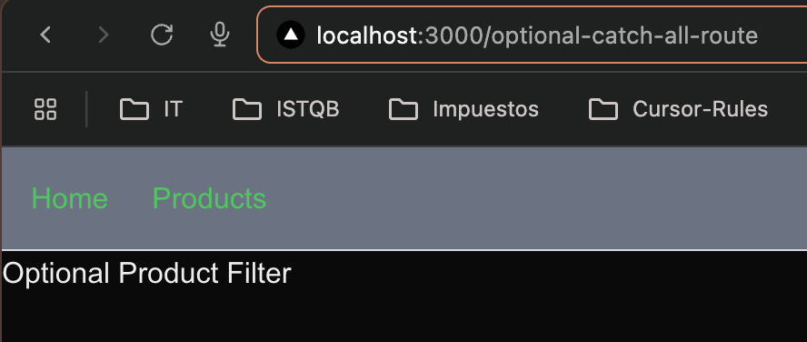

# Step-by-Step Guide: Next.js Concepts

This guide documents the steps taken in this project and provides a reference for future development.

## Completed Steps

### 1. Create a Next.js Project
```bash
# Using create-next-app with the latest features
npx create-next-app@latest

# Selected configuration:
√ What is your project named? ... 02-concepts
√ Would you like to use TypeScript? ... Yes
√ Would you like to use ESLint? ... Yes
√ Would you like to use Tailwind CSS? ... Yes
√ Would you like to use `src/` directory? ... Yes
√ Would you like to use App Router? ... Yes
√ Would you like to customize the default import alias (@/*)? ... Yes
```

### 2. TailwindCSS Setup
TailwindCSS comes preconfigured with create-next-app, but these are the main files:

1. `tailwind.config.js` - Tailwind configuration
2. `postcss.config.js` - PostCSS configuration
3. `src/app/globals.css` - Tailwind styles import

### 3. Create a Simple Route
In Next.js 13+ with App Router, routes are created through folders in the `src/app` directory:

1. Create a `page.tsx` file in the desired folder
2. The route will be accessible at the URL corresponding to the folder structure

Example:
```typescript
// src/app/products/page.tsx
export default function ProductsPage() {
  return (
    <div>
      <h1>Products</h1>
    </div>
  );
}
```

### 4. Create Nested Routes
Nested routes are created by following the folder structure:

```
src/app/
  └── dashboard/
      ├── page.tsx         # /dashboard
      ├── analytics/
      │   └── page.tsx     # /dashboard/analytics
      └── account/
          └── page.tsx     # /dashboard/account
```

### 5. Create a Layout
Layouts allow sharing UI between multiple pages. Example of a dashboard layout:

```typescript
// src/app/dashboard/layout.tsx
export default function DashboardLayout({
  children,
}: {
  children: React.ReactNode;
}) {
  return (
    <div>
      <nav>
        {/* Dashboard Navigation */}
      </nav>
      <main>{children}</main>
    </div>
  );
}
```

### 6. Catch-all Routes
Next.js supports catch-all routes using `[...param]` syntax for dynamic routes that can catch all subsequent route segments. There are two types of catch-all routes: regular and optional.

#### Regular Catch-all Routes (`[...slug]`)
Using `[...slug]` will match routes with one or more segments. The key characteristics are:

- **Requires at least one segment**
- **`params.slug` is always an array**
- **Does NOT match the base route**
- **TypeScript type: `{ slug: string[] }`**

```typescript
// src/app/catch-all-routes/[...slug]/page.tsx
export default async function ProductFilter({
  params,
}: {
  params: Promise<{ slug: string[] }>;  // Note: slug is required
}) {
  const { slug } = await params;
  return (
    <div>
      <h1>Product filter page</h1>
      {/* slug will always be an array with at least one item */}
    </div>
  );
}
```

Project structure:
```
src/app/
  └── catch-all-routes/
      └── [...slug]/
          └── page.tsx    # Matches: /catch-all-routes/a
                         #          /catch-all-routes/a/b
                         # Does NOT match: /catch-all-routes
```

Example matches and params:
```typescript
// Regular [...slug]:
/catch-all-routes/phones           → params.slug = ['phones']
/catch-all-routes/phones/apple     → params.slug = ['phones', 'apple']
/catch-all-routes                  → 404 Error (no match)
```

#### Optional Catch-all Routes (`[[...slug]]`)
Using `[[...slug]]` (double brackets) makes all segments optional. Key differences are:

- **All segments are optional**
- **`params.slug` can be undefined**
- **Matches the base route**
- **TypeScript type: `{ slug?: string[] }`**

```typescript
// src/app/optional-catch-all-route/[[...slug]]/page.tsx
export default async function OptionalProductFilter({
  params,
}: {
  params: Promise<{ slug?: string[] }>;  // Note: slug is optional
}) {
  const { slug } = await params;
  return (
    <div>
      <h1>Optional Product Filter</h1>
      {/* slug can be undefined if no segments are provided */}
      {slug ? (
        <p>Filtering by: {slug.join(' → ')}</p>
      ) : (
        <p>No filters applied</p>
      )}
    </div>
  );
}
```

Project structure:
```
src/app/
  └── optional-catch-all-route/
      └── [[...slug]]/
          └── page.tsx    # Matches: /optional-catch-all-route
                         #          /optional-catch-all-route/a
                         #          /optional-catch-all-route/a/b
```

Example matches and params:
```typescript
// Optional [[...slug]]:
/optional-catch-all-route          → params.slug = undefined
/optional-catch-all-route/phones   → params.slug = ['phones']
/optional-catch-all-route/phones/apple → params.slug = ['phones', 'apple']
```

#### Key Differences Summary

| Feature | [...slug] | \[[...slug]] |
|---------|-----------|-------------|
| Base route match | ❌ | ✅ |
| Minimum segments | 1 | 0 |
| params.slug type | string[] | string[] \| undefined |
| TypeScript type | { slug: string[] } | { slug?: string[] } |
| 404 on no segments | Yes | No |

#### Common Use Cases
1. **Regular [...slug]**:
   - Required category hierarchies
   - Breadcrumb navigation
   - File system paths
   - Multi-step forms


2. **Optional \[[...slug]]**:
   - Optional filtering
   - Search parameters
   - Documentation pages
   - Progressive disclosure UI
   - Default landing pages with optional sub-routes



### 7. Navigation Hooks
Next.js provides powerful navigation hooks for client-side navigation and routing. Here are the three main navigation hooks:

#### useRouter()
The `useRouter()` hook provides programmatic navigation and routing methods:

```typescript
"use client";
import { useRouter } from 'next/navigation';

export default function MyComponent() {
  const router = useRouter();
  
  // Navigation methods
  router.push('/about');      // Navigate to a new route
  router.replace('/login');   // Replace current route (no history entry)
  router.refresh();          // Refresh the current route
  router.back();             // Go back one page
  router.forward();          // Go forward one page
}
```

#### usePathname()
The `usePathname()` hook returns the current URL's pathname:

```typescript
"use client";
import { usePathname } from 'next/navigation';

export default function MyComponent() {
  const pathname = usePathname();
  // Example: if URL is /shop/products/123
  console.log(pathname); // Output: /shop/products/123
}
```

#### useSearchParams()
The `useSearchParams()` hook provides access to the URL's search parameters and offers various methods to interact with them:

```typescript
"use client";
import { useSearchParams } from 'next/navigation';

export default function MyComponent() {
  const searchParams = useSearchParams();
  
  // Example URL: /profile?name=betty&name=sofia&age=25&city=london&active=true
  
  // 1. get() - Get a single value
  const age = searchParams.get('age'); // Returns "25"
  
  // 2. getAll() - Get all values for a parameter
  const names = searchParams.getAll('name'); // Returns ["betty", "sofia"]
  
  // 3. keys() - Get all unique parameter keys
  const keys = Array.from(searchParams.keys()); // Returns ["name", "age", "city", "active"]
  
  // 4. values() - Get all parameter values
  const values = Array.from(searchParams.values()); // Returns ["betty", "sofia", "25", "london", "true"]
  
  // 5. entries() - Get all key-value pairs
  const entries = Array.from(searchParams.entries());
  // Returns [["name", "betty"], ["name", "sofia"], ["age", "25"], ["city", "london"], ["active", "true"]]
  
  // 6. forEach() - Iterate over all key-value pairs
  searchParams.forEach((value, key) => {
    console.log(`${key}: ${value}`);
  });
  // Logs:
  // name: betty
  // name: sofia
  // age: 25
  // city: london
  // active: true
  
  // 7. toString() - Convert to URL query string format
  const queryString = searchParams.toString();
  // Returns "name=betty&name=sofia&age=25&city=london&active=true"
  
  // Practical example: Building a filtered URL
  const newQueryString = new URLSearchParams({
    ...Object.fromEntries(searchParams.entries()),
    page: '2',
    sort: 'desc'
  }).toString();
  // Use with router.push(`/profile?${newQueryString}`);
}
```

Each method serves a specific purpose:
- `get()`: Retrieves the first value of a parameter
- `getAll()`: Retrieves all values for a parameter (useful for multiple values)
- `keys()`: Returns an iterator of all parameter names
- `values()`: Returns an iterator of all parameter values
- `entries()`: Returns an iterator of all key-value pairs
- `forEach()`: Executes a function for each parameter
- `toString()`: Converts parameters to a URL-friendly query string

#### Comparison of Navigation Hooks

| Feature | useRouter() | usePathname() | useSearchParams() |
|---------|------------|---------------|-------------------|
| Purpose | Programmatic navigation & routing control | Get current pathname | Access URL query parameters |
| Client Component Required | Yes | Yes | Yes |
| Main Methods | push(), replace(), refresh(), back(), forward() | N/A (returns string) | get(), getAll(), has(), toString() |
| Use Cases | Navigation actions, route manipulation | Active link styling, conditional rendering based on route | Form handling, filtering, pagination |
| Return Type | Router object | string | URLSearchParams object |
| Example URL: /shop/products?category=books&sort=asc | Full routing control | Returns "/shop/products" | Access to "category" and "sort" params |

## Not Found & Loading Example Plan

### Next.js App Directory Context

- Next.js introduced the app directory to enable advanced routing, layouts, and server components.
- Files like `not-found.tsx` and `loading.tsx` are conventions that enhance UX and error handling.
- Routing is file-system based: folders and files in `src/app` map directly to URLs.
- Special files:
  - `layout.tsx`: Defines persistent layouts for nested routes.
  - `page.tsx`: Defines the main content for a route.
  - `loading.tsx`: Shows a loading UI during slow data/page loads.
  - `not-found.tsx`: Handles 404 errors for missing routes.

### 1. `not-found.tsx`

#### How It Works
- Next.js automatically renders this file for unmatched routes.
- Can be placed at any level in the app directory for scoped 404 handling (e.g., per section).
- Supports both static and dynamic content.
- Can use React components, images, links, and custom styles.

#### Goals
- Improve navigation and error recovery.
- Maintain brand consistency even on error pages.
- Optionally log or track 404 events for analytics.

#### Risks
- Over-customization may distract from the main site.
- Missing or misconfigured `not-found.tsx` can result in default, unstyled errors.
- If placed incorrectly, may not catch all 404s as intended.

#### Code:
```tsx
// ./src/app/not-found.tsx
"use client";
import { useRouter } from "next/navigation";

function NotFoundPage() {
  const router = useRouter();
  return (
    <div>
      <h1>The page you are looking for was not found!</h1>
      <button onClick={() => router.push('/')} className="bg-green-500 border-0 border-white p-5 text-white">go to Homepage</button>
    </div>
  )
}

export default NotFoundPage;
```
#### Test:
- URL: `http://localhost:3000/medicis`
- Response: `The page you are looking for was not found!`
- Button: `go to Homepage` visible

---

### 2. Loading Example Files

#### Files:
- `./src/app/loading-example/page.tsx`
- `./src/app/loading-example/loading.tsx`

#### How They Work
- `loading.tsx` is rendered automatically when a route or its data is slow to load.
- Can be used with server components, client components, or data fetching (e.g., `fetch`, `getServerSideProps`).
- Supports custom spinners, skeleton screens, or messages.
- Can be scoped to specific routes for granular loading states.

#### Goals
- Reduce perceived wait times and improve engagement.
- Communicate progress and prevent confusion.
- Allow for branded or animated loading experiences.

#### Risks
- Overly complex loading UIs may impact performance.
- Inconsistent loading experiences across routes can confuse users.
- If not implemented, users may see blank screens during slow loads.

#### Additional Details
- Works with Next.js streaming and suspense features.
- Can be combined with error boundaries for robust UX.
- Loading UI is only shown if the page or data is slow to resolve.
- Best practice: keep loading UI simple and informative.


#### Structure:
```
02-concepts
└── src
    └── app
        └── loading-example
            ├── loading.tsx    
            └── page.tsx    
```

#### Code:
```tsx
// loading-example.tsx
export default function LoadingExampleLoader(){
  return (
    <div className="p-8">
      <div>Loading...</div>
    </div>
  )
}


// page.tsx
async function getData(){
  await new Promise((resolve) => setTimeout(resolve, 2000));
  return {
    stats: {
      users: 10000
    }
  }
}
export default async function LoadingExamplePage() {
  const data = await getData();
  return(
    <div className="p-4">
      <h1>Loading example</h1>
      <p className="font-bold text-sm">Users: {data.stats.users}</p>

    </div>
  )
}
```
---

### Next.js Features Related to These Files

- **File-based Routing:** Each file/folder in `src/app` is a route.
- **Server Components:** Can fetch data on the server, reducing client-side JS.
- **Streaming:** Next.js can stream parts of the UI as they become ready, showing loading states.
- **Error Boundaries:** Can catch and display errors gracefully, often paired with `not-found.tsx`.
- **Custom 404 and Loading:** Improves SEO, accessibility, and user retention.

---

### Summary
- `not-found.tsx` and `loading.tsx` are essential for robust, user-friendly Next.js apps.
- They leverage Next.js conventions for error and loading handling.
- Proper use improves navigation, branding, and perceived performance.
- Risks are mostly related to poor UX, missing files, or misconfiguration.
- Next.js's app directory and conventions make these features easy to implement and customize.

---
### 8. Route Groups in Next.js

## Objective
Route Groups in Next.js allow you to organize routes without affecting the URL path structure. They are particularly useful for:
- Organizing routes into logical groups
- Creating multiple root layouts for different sections of your application
- Organizing routes by feature, team, or other custom groupings

## Use Cases
1. **Shared Layouts**: Create a common layout for a group of related routes (e.g., marketing pages)
2. **Code Organization**: Group related routes together without affecting the URL structure
3. **Team-based Organization**: Separate routes based on team ownership or responsibility

## Implementation
Route Groups are created by wrapping a folder name in parentheses. For example:
```
src/app/(marketing)/
  ├── about/
  │   └── page.tsx
  ├── contact/
  │   └── page.tsx
  └── layout.tsx
```

## How to Access in Browser
- About page: `http://localhost:3000/about`
- Contact page: `http://localhost:3000/contact`

Note: The folder name in parentheses `(marketing)` is not included in the URL path.

## What NOT to Look for in Browser
- Do NOT try to access `/marketing/about` or `/marketing/contact`
- The route group name `(marketing)` is purely organizational and does not appear in the URL

## Dependencies
1. **Next.js**: Version 13.0 or higher
2. Required files:
   - Layout file (`layout.tsx`) for shared components
   - Page files (`page.tsx`) for each route

## Benefits and Risks

### Benefits
1. **Better Code Organization**: Group related routes logically
2. **Shared Layouts**: Create specific layouts for groups of pages
3. **Clean URLs**: URL structure remains clean and user-friendly
4. **Team Collaboration**: Easier to manage code when multiple teams work on different sections

### Risks
1. **Naming Conflicts**: Ensure unique route names across different groups
2. **Complexity**: Over-organization can lead to unnecessary complexity
3. **Maintenance**: Need to maintain consistency in layout structure
4. **Navigation**: Must ensure correct routing between grouped pages

## Best Practices
1. Use meaningful group names that reflect the purpose of the routes
2. Keep the folder structure shallow and manageable
3. Document the route group structure for team reference
4. Use shared layouts effectively for consistent UI
5. Avoid deeply nested route groups

---

### 9. Metadata and Types

Next.js provides a powerful Metadata API that allows you to define metadata for your pages. This metadata is crucial for SEO, social sharing, and browser behavior. Let's examine the implemented examples and then explore potential enhancements.

#### Current Implementation

##### Static Metadata Example
In our project, we have implemented static metadata in the main metadata example page:

```typescript
// src/app/metadata-example/page.tsx
export const metadata: Metadata = {
  title: "Metadata example",
  description: "This is my example of writing static metadata",
}
```

This basic implementation shows:
- Import of the `Metadata` type from Next.js
- Static export of metadata object
- Basic title and description properties

##### Dynamic Metadata Example
Our project implements dynamic metadata for individual items:

```typescript
// src/app/metadata-example/[slug]/page.tsx
export async function generateMetadata(
  { params }: { params: Promise<{ slug: string }> }
): Promise<Metadata> {
  const { slug } = await params;
  const data = dummyData[slug as keyof typeof dummyData];

  return {
    title: data.title,
    description: data.title,
  }
}
```

This implementation demonstrates:
- Dynamic metadata generation based on route parameters
- Async function for data fetching
- Type safety with TypeScript
- Basic title and description based on dynamic data

#### How Metadata is Displayed

##### Static Metadata Display
The static metadata from our example is displayed in various contexts:

1. **Browser Tab/Window:**
   ```
   Title: "Metadata example"
   ```
   

2. **Search Engine Results:**
   ```
   Title: Metadata example
   URL: your-site.com/metadata-example
   Description: This is my example of writing static metadata
   ```

##### Dynamic Metadata Display
The dynamic metadata changes based on the route parameter:

1. **Browser Tab/Window:**
   ```
   For /metadata-example/1: "Page Un 👍🏽"
   For /metadata-example/2: "Page Deux ✍🏻"
   For /metadata-example/3: "Page Trois ✨"
   For /metadata-example/4: "Page Quatre 🎉"
   ```
   

2. **Search Engine Results:**
   ```
   Title: [Dynamic title based on slug]
   URL: your-site.com/metadata-example/[slug]
   Description: [Same as title in our implementation]
   ```

##### Viewing Metadata in Development
You can inspect the generated metadata in several ways:

1. **Browser Dev Tools:**
   - Right-click → View Page Source
   - Look for `<head>` section
   - Find `<title>`, `<meta>`, and other tags

2. **Next.js Dev Tools:**
   ```bash
   # Enable dev tools in development
   NEXT_DEV_TOOLS=1 npm run dev
   ```
   Then use the "Metadata" tab in the dev overlay

3. **Using curl:**
   ```bash
   # For static metadata
   curl -X GET http://localhost:3000/metadata-example

   # For dynamic metadata
   curl -X GET http://localhost:3000/metadata-example/1
   ```

#### 9.1 Enhancement for Static Metadata

The current static metadata implementation can be enhanced with additional features for better SEO and social sharing:

```typescript
// Enhanced static metadata example
export const metadata: Metadata = {
  title: "Metadata example",
  description: "This is my example of writing static metadata",
  
  // Basic SEO
  keywords: ["nextjs", "metadata", "seo"],
  authors: [{ name: "Your Name" }],
  
  // Open Graph
  openGraph: {
    title: "Metadata Example - Social Share",
    description: "Learn about implementing metadata in Next.js",
    type: "website",
    images: [
      {
        url: "/og-image.jpg",
        width: 1200,
        height: 630,
        alt: "Metadata Example",
      }
    ],
  },
  
  // Twitter
  twitter: {
    card: "summary_large_image",
    title: "Metadata Example",
    description: "Learn about implementing metadata in Next.js",
    images: ["/twitter-image.jpg"],
    creator: "@yourusername",
  },
  
  // Robots
  robots: {
    index: true,
    follow: true,
    googleBot: {
      index: true,
      follow: true,
    },
  },
  
  // Icons
  icons: {
    icon: [
      { url: "/favicon.ico" },
      { url: "/icon.png", type: "image/png" },
    ],
    apple: [
      { url: "/apple-icon.png" },
    ],
  },
  
  // Verification
  verification: {
    google: "google-site-verification-code",
    yandex: "yandex-verification-code",
  },
}
```

#### 9.2 Enhancement for Dynamic Metadata

The current dynamic metadata implementation can be enhanced with more robust features:

```typescript
// Enhanced dynamic metadata example
export async function generateMetadata(
  { params }: { params: Promise<{ slug: string }> }
): Promise<Metadata> {
  try {
    const { slug } = await params;
    const data = dummyData[slug as keyof typeof dummyData];
    
    // Fallback data in case of missing information
    const fallbackData = {
      title: "Default Title",
      description: "Default description for our content",
      image: "/default-image.jpg",
    };

    // Construct metadata with fallback
    return {
      title: data?.title || fallbackData.title,
      description: data?.description || fallbackData.description,

      // Open Graph
      openGraph: {
        title: data?.title || fallbackData.title,
        description: data?.description || fallbackData.description,
        type: "article",
        publishedTime: data?.publishedAt || new Date().toISOString(),
        authors: data?.author ? [data.author] : ["Default Author"],
        images: [
          {
            url: data?.image || fallbackData.image,
            width: 1200,
            height: 630,
            alt: data?.imageAlt || "Default image alt",
          },
        ],
      },

      // Twitter
      twitter: {
        card: "summary_large_image",
        title: data?.title || fallbackData.title,
        description: data?.description || fallbackData.description,
        images: [data?.image || fallbackData.image],
      },

      // Structured Data (JSON-LD)
      other: {
        "script:ld+json": {
          "@context": "https://schema.org",
          "@type": "Article",
          headline: data?.title || fallbackData.title,
          description: data?.description || fallbackData.description,
          image: data?.image || fallbackData.image,
          datePublished: data?.publishedAt || new Date().toISOString(),
          author: {
            "@type": "Person",
            name: data?.author || "Default Author",
          },
        },
      },
    };
  } catch (error) {
    // Fallback metadata in case of errors
    console.error("Error generating metadata:", error);
    return {
      title: "Error - Metadata Example",
      description: "Something went wrong while loading this page",
    };
  }
}
```

Key Enhancements in Dynamic Metadata:
1. Error handling with try-catch
2. Fallback values for missing data
3. Structured data (JSON-LD) for better SEO
4. Comprehensive OpenGraph and Twitter card metadata
5. Type safety with TypeScript
6. Proper date handling
7. Image optimization considerations

---
## Suggested Next Steps

### 1. SEO & Metadata Enhancement
- Implement structured data (JSON-LD)
- Add dynamic OpenGraph images
- Set up automated metadata validation
- Create custom metadata templates

### 2. Data Handling
- Implement data loading with `loading.tsx`
- Use Server Components vs Client Components
- Implement error handling with `error.tsx`
- Set up data caching strategies

### 3. Authentication & Authorization
- Set up an authentication system
- Protect private routes
- Handle user roles
- Implement JWT or session management

### 4. API Routes
- Create API endpoints
- Handle HTTP methods
- Implement middleware
- Set up API documentation

### 5. Advanced Components
- Create reusable components
- Implement forms with validation
- Create modals and popups
- Build accessible UI components

### 6. Optimization & Performance
- Implement image loading with `next/image`
- Optimize fonts with `next/font`
- Implement progressive loading
- Set up performance monitoring

### 7. Global State
- Implement state management (Zustand/Redux)
- Handle server state
- Implement caching
- Set up state persistence

### 8. Testing
- Set up Jest and React Testing Library
- Write unit tests
- Implement integration tests
- Add E2E testing with Cypress

### 9. Deployment & DevOps
- Set up CI/CD pipeline
- Optimize for production
- Implement monitoring
- Configure environment variables

## Additional Resources
- [Next.js Official Documentation](https://nextjs.org/docs)
- [TailwindCSS Guide](https://tailwindcss.com/docs)
- [TypeScript Handbook](https://www.typescriptlang.org/docs/)