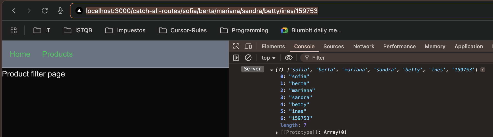
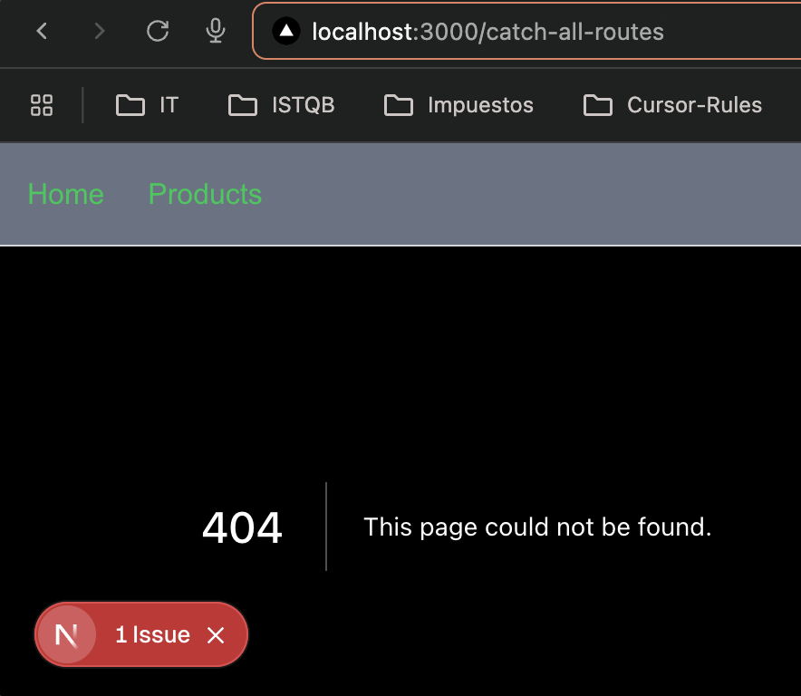

# Step-by-Step Guide: Next.js Concepts

This guide documents the steps taken in this project and provides a reference for future development.

## Completed Steps

### 1. Create a Next.js Project
```bash
# Using create-next-app with the latest features
npx create-next-app@latest

# Selected configuration:
√ What is your project named? ... 02-concepts
√ Would you like to use TypeScript? ... Yes
√ Would you like to use ESLint? ... Yes
√ Would you like to use Tailwind CSS? ... Yes
√ Would you like to use `src/` directory? ... Yes
√ Would you like to use App Router? ... Yes
√ Would you like to customize the default import alias (@/*)? ... Yes
```

### 2. TailwindCSS Setup
TailwindCSS comes preconfigured with create-next-app, but these are the main files:

1. `tailwind.config.js` - Tailwind configuration
2. `postcss.config.js` - PostCSS configuration
3. `src/app/globals.css` - Tailwind styles import

### 3. Create a Simple Route
In Next.js 13+ with App Router, routes are created through folders in the `src/app` directory:

1. Create a `page.tsx` file in the desired folder
2. The route will be accessible at the URL corresponding to the folder structure

Example:
```typescript
// src/app/products/page.tsx
export default function ProductsPage() {
  return (
    <div>
      <h1>Products</h1>
    </div>
  );
}
```

### 4. Create Nested Routes
Nested routes are created by following the folder structure:

```
src/app/
  └── dashboard/
      ├── page.tsx         # /dashboard
      ├── analytics/
      │   └── page.tsx     # /dashboard/analytics
      └── account/
          └── page.tsx     # /dashboard/account
```

### 5. Create a Layout
Layouts allow sharing UI between multiple pages. Example of a dashboard layout:

```typescript
// src/app/dashboard/layout.tsx
export default function DashboardLayout({
  children,
}: {
  children: React.ReactNode;
}) {
  return (
    <div>
      <nav>
        {/* Dashboard Navigation */}
      </nav>
      <main>{children}</main>
    </div>
  );
}
```

### 6. Catch-all Routes
Next.js supports catch-all routes using `[...param]` syntax for dynamic routes that can catch all subsequent route segments. There are two types of catch-all routes: regular and optional.

#### Regular Catch-all Routes (`[...slug]`)
Using `[...slug]` will match routes with one or more segments. The key characteristics are:

- **Requires at least one segment**
- **`params.slug` is always an array**
- **Does NOT match the base route**
- **TypeScript type: `{ slug: string[] }`**

```typescript
// src/app/catch-all-routes/[...slug]/page.tsx
export default async function ProductFilter({
  params,
}: {
  params: Promise<{ slug: string[] }>;  // Note: slug is required
}) {
  const { slug } = await params;
  return (
    <div>
      <h1>Product filter page</h1>
      {/* slug will always be an array with at least one item */}
    </div>
  );
}
```

Project structure:
```
src/app/
  └── catch-all-routes/
      └── [...slug]/
          └── page.tsx    # Matches: /catch-all-routes/a
                         #          /catch-all-routes/a/b
                         # Does NOT match: /catch-all-routes
```

Example matches and params:
```typescript
// Regular [...slug]:
/catch-all-routes/phones           → params.slug = ['phones']
/catch-all-routes/phones/apple     → params.slug = ['phones', 'apple']
/catch-all-routes                  → 404 Error (no match)
```

#### Optional Catch-all Routes (`[[...slug]]`)
Using `[[...slug]]` (double brackets) makes all segments optional. Key differences are:

- **All segments are optional**
- **`params.slug` can be undefined**
- **Matches the base route**
- **TypeScript type: `{ slug?: string[] }`**

```typescript
// src/app/optional-catch-all-route/[[...slug]]/page.tsx
export default async function OptionalProductFilter({
  params,
}: {
  params: Promise<{ slug?: string[] }>;  // Note: slug is optional
}) {
  const { slug } = await params;
  return (
    <div>
      <h1>Optional Product Filter</h1>
      {/* slug can be undefined if no segments are provided */}
      {slug ? (
        <p>Filtering by: {slug.join(' → ')}</p>
      ) : (
        <p>No filters applied</p>
      )}
    </div>
  );
}
```

Project structure:
```
src/app/
  └── optional-catch-all-route/
      └── [[...slug]]/
          └── page.tsx    # Matches: /optional-catch-all-route
                         #          /optional-catch-all-route/a
                         #          /optional-catch-all-route/a/b
```

Example matches and params:
```typescript
// Optional [[...slug]]:
/optional-catch-all-route          → params.slug = undefined
/optional-catch-all-route/phones   → params.slug = ['phones']
/optional-catch-all-route/phones/apple → params.slug = ['phones', 'apple']
```

#### Key Differences Summary

| Feature | [...slug] | \[[...slug]] |
|---------|-----------|-------------|
| Base route match | ❌ | ✅ |
| Minimum segments | 1 | 0 |
| params.slug type | string[] | string[] \| undefined |
| TypeScript type | { slug: string[] } | { slug?: string[] } |
| 404 on no segments | Yes | No |

#### Common Use Cases
1. **Regular [...slug]**:
   - Required category hierarchies
   - Breadcrumb navigation
   - File system paths
   - Multi-step forms




2. **Optional \[[...slug]]**:
   - Optional filtering
   - Search parameters
   - Documentation pages
   - Progressive disclosure UI
   - Default landing pages with optional sub-routes


### 7. Navigation Hooks
Next.js provides powerful navigation hooks for client-side navigation and routing. Here are the three main navigation hooks:

#### useRouter()
The `useRouter()` hook provides programmatic navigation and routing methods:

```typescript
"use client";
import { useRouter } from 'next/navigation';

export default function MyComponent() {
  const router = useRouter();
  
  // Navigation methods
  router.push('/about');      // Navigate to a new route
  router.replace('/login');   // Replace current route (no history entry)
  router.refresh();          // Refresh the current route
  router.back();             // Go back one page
  router.forward();          // Go forward one page
}
```

#### usePathname()
The `usePathname()` hook returns the current URL's pathname:

```typescript
"use client";
import { usePathname } from 'next/navigation';

export default function MyComponent() {
  const pathname = usePathname();
  // Example: if URL is /shop/products/123
  console.log(pathname); // Output: /shop/products/123
}
```

#### useSearchParams()
The `useSearchParams()` hook provides access to the URL's search parameters and offers various methods to interact with them:

```typescript
"use client";
import { useSearchParams } from 'next/navigation';

export default function MyComponent() {
  const searchParams = useSearchParams();
  
  // Example URL: /profile?name=betty&name=sofia&age=25&city=london&active=true
  
  // 1. get() - Get a single value
  const age = searchParams.get('age'); // Returns "25"
  
  // 2. getAll() - Get all values for a parameter
  const names = searchParams.getAll('name'); // Returns ["betty", "sofia"]
  
  // 3. keys() - Get all unique parameter keys
  const keys = Array.from(searchParams.keys()); // Returns ["name", "age", "city", "active"]
  
  // 4. values() - Get all parameter values
  const values = Array.from(searchParams.values()); // Returns ["betty", "sofia", "25", "london", "true"]
  
  // 5. entries() - Get all key-value pairs
  const entries = Array.from(searchParams.entries());
  // Returns [["name", "betty"], ["name", "sofia"], ["age", "25"], ["city", "london"], ["active", "true"]]
  
  // 6. forEach() - Iterate over all key-value pairs
  searchParams.forEach((value, key) => {
    console.log(`${key}: ${value}`);
  });
  // Logs:
  // name: betty
  // name: sofia
  // age: 25
  // city: london
  // active: true
  
  // 7. toString() - Convert to URL query string format
  const queryString = searchParams.toString();
  // Returns "name=betty&name=sofia&age=25&city=london&active=true"
  
  // Practical example: Building a filtered URL
  const newQueryString = new URLSearchParams({
    ...Object.fromEntries(searchParams.entries()),
    page: '2',
    sort: 'desc'
  }).toString();
  // Use with router.push(`/profile?${newQueryString}`);
}
```

Each method serves a specific purpose:
- `get()`: Retrieves the first value of a parameter
- `getAll()`: Retrieves all values for a parameter (useful for multiple values)
- `keys()`: Returns an iterator of all parameter names
- `values()`: Returns an iterator of all parameter values
- `entries()`: Returns an iterator of all key-value pairs
- `forEach()`: Executes a function for each parameter
- `toString()`: Converts parameters to a URL-friendly query string

#### Comparison of Navigation Hooks

| Feature | useRouter() | usePathname() | useSearchParams() |
|---------|------------|---------------|-------------------|
| Purpose | Programmatic navigation & routing control | Get current pathname | Access URL query parameters |
| Client Component Required | Yes | Yes | Yes |
| Main Methods | push(), replace(), refresh(), back(), forward() | N/A (returns string) | get(), getAll(), has(), toString() |
| Use Cases | Navigation actions, route manipulation | Active link styling, conditional rendering based on route | Form handling, filtering, pagination |
| Return Type | Router object | string | URLSearchParams object |
| Example URL: /shop/products?category=books&sort=asc | Full routing control | Returns "/shop/products" | Access to "category" and "sort" params |

## Suggested Next Steps

### 1. Data Handling
- Implement data loading with `loading.tsx`
- Use Server Components vs Client Components
- Implement error handling with `error.tsx`

### 2. Authentication & Authorization
- Set up an authentication system
- Protect private routes
- Handle user roles

### 3. API Routes
- Create API endpoints
- Handle HTTP methods
- Implement middleware

### 4. Advanced Components
- Create reusable components
- Implement forms with validation
- Create modals and popups

### 5. Optimization & Performance
- Implement image loading with `next/image`
- Optimize fonts with `next/font`
- Implement progressive loading

### 6. Global State
- Implement state management (Zustand/Redux)
- Handle server state
- Implement caching

### 7. Testing
- Set up Jest and React Testing Library
- Write unit tests
- Implement integration tests

### 8. Deployment
- Set up CI/CD
- Optimize for production
- Implement monitoring

## Additional Resources
- [Next.js Official Documentation](https://nextjs.org/docs)
- [TailwindCSS Guide](https://tailwindcss.com/docs)
- [TypeScript Handbook](https://www.typescriptlang.org/docs/)